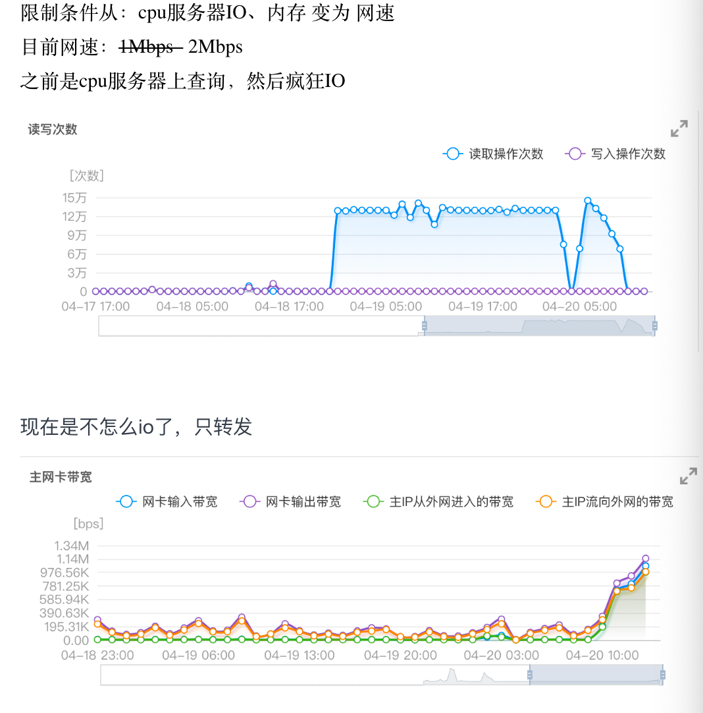

# 周报
* 2020.4.16-2020.4.22
* Bear
## 本周工作
#### bdci
1. bdci代码上传
将修改后的代码上传到了github上
 * 地址 [https://github.com/bearbro/BDCI2019-Negative_Finance_Info_Judge](https://github.com/bearbro/BDCI2019-Negative_Finance_Info_Judge)
  * 详情 [🔗](https://72b27340.wiz03.com/wapp/pages/view/share/s/1OIDd00vu4cV2ZGM4M3sXIVT3mK72S34akuM2wdnD43VkB7R)
1. 相关
* 最后一个模型的结果没出来：连接超时被踢下线了，感觉意义不大，没再跑
* 项目的预训练脚本：作者回复说代码在学校，受疫情影响，开学后再上传

#### 唐QA
###### 总
1. 跑了5个sim的模型，单模型f1有所提升达到0.676
1. 尝试用新的特征进行融合，结果f1下降了0.01
###### 具体
1. 环境搭建
  * 租cpu服务器，搭建环境，搭建neo4j数据库
存在问题：百度AI无法访问校园网内的知识库
一开始的解决方案：
方案二：百度AI+CPU服务器
在百度AI上跑
租一台CPU服务器用于搭建知识库
稳定性：一般
运行效率：低，取决于cpu服务器的配置（主要是内存，内存不够拿磁盘上，导致大量的io操作）（4跳：6分钟/问题）
费用：一般，取决于cpu服务器的配置
目前的：
方案四：百度AI+内网穿透 香（一开始没想到😢）
在百度AI上跑
租一台CPU服务器做为内网穿透的中转服务器
稳定性：一般
运行效率：高，取决于网络状态（目前2Mbps的网，2跳的情况一个模型5hours）（2跳：1分钟/问题）
费用：一般，取决于cpu服务器的配置

1 . 将bert-base换成其他预训练的模型
  * bert-wwm-ext 有提升0.652（2跳）
  * roberta-wwm-large-ext 降低了0.636（4跳）
1.  看了下keras-bert，修改模型后面的部分，将输入从cls改为cls+content
结果没有提升，反而变差了0.646（2跳）
1.  实现f1的计算函数，计算验证集的f1，在训练时作为早停/模型保存的指示
结果有提升：0.676（学姐：0.661）
1.  换了个linking_data_path，
结果:0.671 和0.676比变差了一点
1. 融合
  * 尝试了融合部分新的特征，从1+6变为1+2*6和1+3*6
  将路径拆为实体和关系两部分
  分别计算（问题，实体），（问题，关系），（问题，路径）的相似度作为特征
  以原来的数据进行的使用，结果显示：没有提升，降低了一点点（从0.68->0.67）
   * 优化了融合数据生成的流程，从多步改为当步

## 下周安排
##### 模型
优化 class模型？
##### 融合
代码实现多个预测结果ok文件的融合
####其他待定